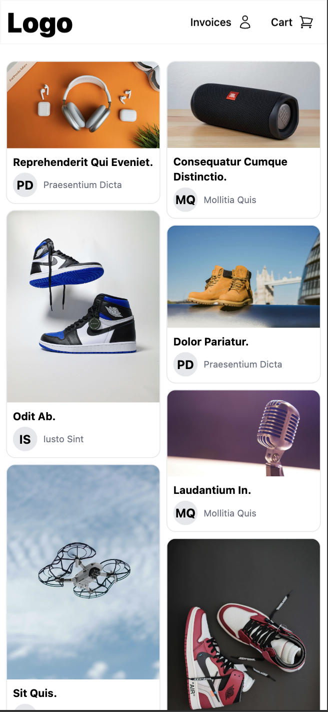
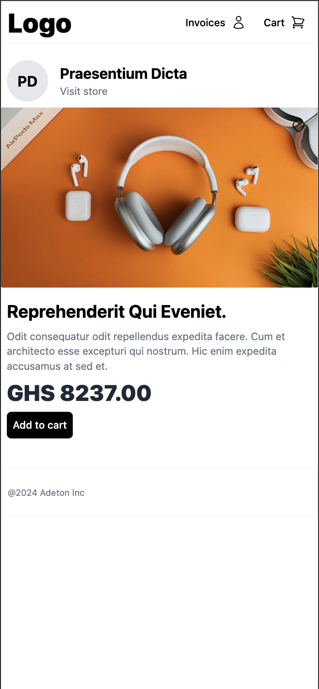
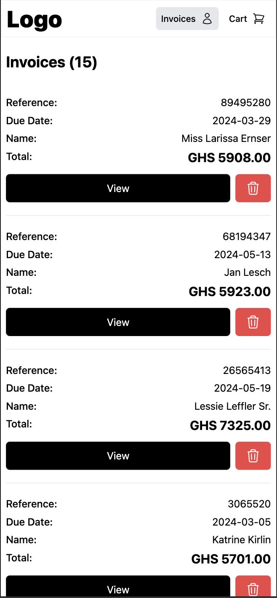
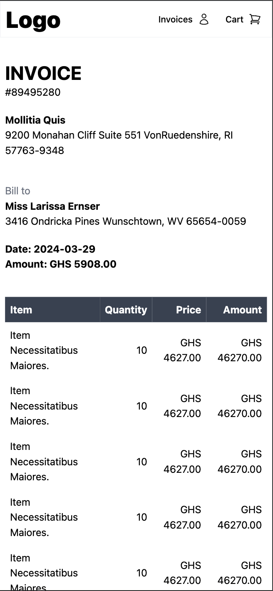

## Laravel Shopping SPA

This is a simple shopping SPA built with Laravel and Vue.js. It is a single page application that allows users to 
browse products and invoices.

## Features
- Browse products
- Add products to cart
- View invoices
- View invoice details
- View product details

## Installation
1. Clone the repository
2. Run `composer install`
3. Copy `.env.example` to `.env` and update the database credentials using mysql
4. Run `yarn dev`
5. Run `php artisan serve`
6. Visit `http://localhost:8000`

## Screenshots

